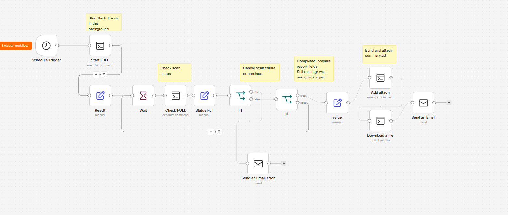

# Security Scanner

An IPv4 exposure scanning pipeline built with Docker, Naabu, httpx and Nuclei, with asynchronous orchestration through n8n.

Fetch announced prefixes for an explicitly configured ASN, find open ports, identify HTTP services and collect critical Nuclei template matches. Each run has its own status, log and result directory.

```text
RIPEstat -> IPv4 prefixes -> Naabu -> httpx -> Nuclei
                                                |
                                      results/full_<SCAN_ID>
                                                |
                          n8n -> summary.txt -> email attachment
```

This is a sanitized adaptation of an existing deployment. No production ASN, target lists, scan results, email addresses or credentials are included. Changes in this distribution have not yet been tested with a live Docker scan.

## Scope

Use only on systems you own or are explicitly authorized to assess. Confirm that every announced prefix is within your authorization before starting. An ASN announcement is not proof of permission to scan all hosted systems.

FULL means the configured ASN's announced IPv4 range, using Naabu's top 100 ports. It does not mean all 65,535 ports or a comprehensive service audit. HTTP services form the input to the downstream Nuclei scan. Non-HTTP services need separate assessment.

Nuclei matches require review; they are not independently confirmed exploitability. `-ni` disables Interactsh/OAST checks, not all intrusive behavior. Review the selected templates before production use. The intended operational scope excludes brute force and exploitation; selecting critical severity alone does not enforce that restriction.

## Install on a Linux Docker host

Requirements: Bash, Docker Engine with the Compose plugin, Python 3, curl and jq on the **host**. The scripts call Docker from the host; Python normalization and report extraction also run there. n8n is deployed separately.

Place this repository at `/opt/security-scanner`. Commands below assume an administrator shell.

```bash
cd /opt/security-scanner
apt install -y python3 curl jq
chmod 755 scripts/*.sh
mkdir -p config data/results
cp config/asn.txt.example config/asn.txt
nano config/asn.txt
```

Replace the placeholder with your authorized ASN in `AS<number>` format. There is deliberately no default scan target.

```bash
docker compose up -d --build
docker ps --filter name=security-scanner
./scripts/get-prefixes.sh
cat data/prefixes.txt
```

Review the fetched target list before running a scan. The FULL runner fetches current announcements again when it starts.

## Run and check a FULL scan

```bash
sudo /opt/security-scanner/scripts/start-full-scan.sh
```

Save the returned `SCAN_ID`. For the following commands, replace `YYYYMMDD_HHMMSS` with that exact value:

```bash
sudo /opt/security-scanner/scripts/check-full-scan.sh YYYYMMDD_HHMMSS
tail -f /opt/security-scanner/data/results/full_YYYYMMDD_HHMMSS/scan.log
```

`Ctrl+C` stops the log viewer, not the background scan. When status is `COMPLETED`, generate the attachment:

```bash
sudo /opt/security-scanner/scripts/make-summary.sh YYYYMMDD_HHMMSS
```

**Compatibility change:** this distribution requires a scan ID for `make-summary.sh`. Update existing n8n commands and sudoers rules accordingly. It avoids attaching a different run's report by selecting the latest directory implicitly.

## Scripts

| Script | Input | Role / output |
| --- | --- | --- |
| `get-prefixes.sh` | `config/asn.txt` | Fetches RIPEstat announcements and writes IPv4 prefixes to `data/prefixes.txt`. |
| `start-full-scan.sh` | None | Creates an ID, starts the worker with `nohup`, writes its PID and returns immediately. |
| `run-full-scan.sh` | Optional internal `SCAN_ID` environment value | Fetches/collapses prefixes, counts addresses, updates templates and runs the three scanning tools. Writes `summary.env` and terminal status. Normally invoked by the start script. |
| `check-full-scan.sh` | Scan ID | Prints `STATUS=...`, available counters and the text between `CRITICAL_LIST_BEGIN` / `CRITICAL_LIST_END`. Missing directory returns `NOT_FOUND` with exit code 2. |
| `make-summary.sh` | Completed scan ID | Writes `summary.txt` with counts and open ports; prints its absolute host path as `SUMMARY=...`. |
| `scan-host.sh` | One authorized IPv4 address | Scans a single host into `data/results/<IP>_<timestamp>`. Requires templates already present. It does not use the FULL status protocol. |

## Parameters

| Tool | FULL scan settings |
| --- | --- |
| Naabu | `-top-ports 100 -rate 3000 -silent` |
| httpx | title, technology, status code and server metadata; JSONL output |
| Nuclei | `-severity critical -ni -c 100 -rate-limit 300 -timeout 10 -retries 1 -jsonl` |

The provided source uses Naabu rate **3000**. A rate of 5000 is not configured. Single-host Nuclei uses concurrency 50 and rate limit 150. Adjust rates to the authorized environment's capacity.

The Dockerfile builds upstream `@latest` tools and the worker updates templates each run. Builds and findings can change over time; pin tested versions/template revisions for reproducible deployments.

## Results

```text
/opt/security-scanner/
  config/asn.txt                 local target configuration, ignored by Git
  scripts/                      host orchestration scripts
  data/                         ignored by Git
    prefixes.txt
    prefixes-collapsed.txt
    nuclei-templates/
    results/full_<SCAN_ID>/
      status.txt                STARTING / RUNNING / COMPLETED / FAILED
      pid.txt                   host worker PID, not container PID
      scan.log                  worker and tool output
      ports.txt                 discovered IP:port pairs
      httpx.jsonl               HTTP probe records
      urls.txt                  URLs passed to Nuclei
      nuclei.jsonl              template matches
      critical-summary.txt      compact match descriptions
      summary.env               machine-readable counters
      summary.txt               generated email attachment
```

Host `data/` is mounted at container `/data/`. `RESULT_DIR` in the worker's output is a container path; `SUMMARY` from the report script is a host path for SSH download.

`PORTS` and `HTTP` count output lines, not distinct hosts. `HOSTS` in the generated report counts distinct IPv4 addresses in `ports.txt`. `CRITICAL` counts Nuclei result records, not unique CVEs. `PREFIX_IPS` is the number of addresses in collapsed IPv4 networks.

## n8n



Workflow overview from the original editor. The public export uses a manual trigger and clearer node names; the screenshot shows the original schedule trigger and labels.

Import [the sanitized workflow](n8n/security-scanner-full.json), then follow [the n8n integration guide](docs/n8n.md). The export starts inactive with a manual trigger, has no credential bindings and uses example email addresses. Configure it before running.

## After a restart

```bash
cd /opt/security-scanner
docker compose up -d
docker ps --filter name=security-scanner
```

An interrupted host worker does **not** resume when the container starts. Inspect its log and process state, preserve partial results, then start a new run. A stale `RUNNING` file does not prove that a worker is alive.

## Troubleshooting and limitations

| Symptom | Check / action |
| --- | --- |
| No new log lines | Check `ps aux` for the worker/tools and `docker stats --no-stream security-scanner`. Quiet output can occur between discoveries. |
| Container missing/stopped | Run `docker compose up -d --build` and inspect the build error. |
| Naabu build / shared-library error | This distribution adds `libpcap-dev` to the build stage and `libpcap0.8` to runtime. Rebuild the image. |
| Invalid ASN | Replace the example placeholder in `config/asn.txt`. |
| SSH permission denied | Check the n8n credential, host ownership, and exact sudoers paths. Commands must explicitly use `sudo`. |
| Empty email fields | Reference the parsing node explicitly, rather than the download node's `$json`. |
| Missing attachment | Download `SUMMARY` as binary `data`; configure the mail node to attach `data`. |
| No open ports / HTTP services | Review the log. The inherited runner does not explicitly skip downstream tools on empty input; tool-version behavior may vary. |
| Stale RUNNING | The check script reads files, not worker liveness. An abrupt stop/reboot may leave stale status. Verify processes and start a new run after preserving results. |

Run only **one FULL scan at a time**. Prefix and template paths are shared and no cross-run lock is implemented; IDs have one-second resolution. Do not automatically retry Start after an uncertain SSH response: first check whether it already created a run.

Root-launched scripts and their configuration must be writable only by administrators. Do not grant the n8n SSH user write access to executable scripts. Provide it with read access to result files through a dedicated group/ACL as required by your installation.

## Upstream projects

- [Naabu](https://github.com/projectdiscovery/naabu)
- [httpx](https://github.com/projectdiscovery/httpx)
- [Nuclei](https://github.com/projectdiscovery/nuclei) / [OAST behavior](https://docs.projectdiscovery.io/opensource/nuclei/running)
- [RIPEstat](https://stat.ripe.net/)
- [n8n](https://n8n.io/)

This project's scripts and documentation are available under the [MIT License](LICENSE). Upstream tools retain their own licenses.
